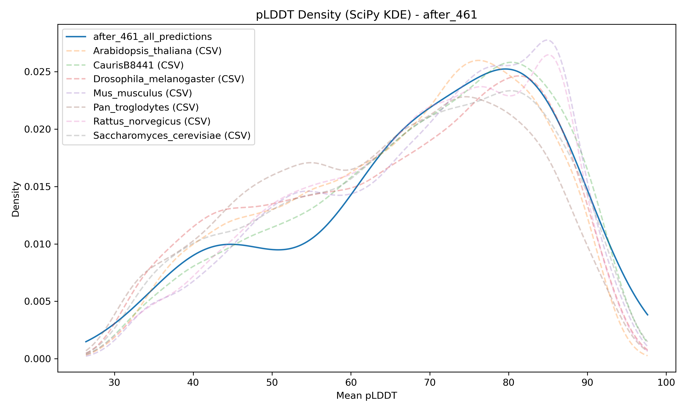
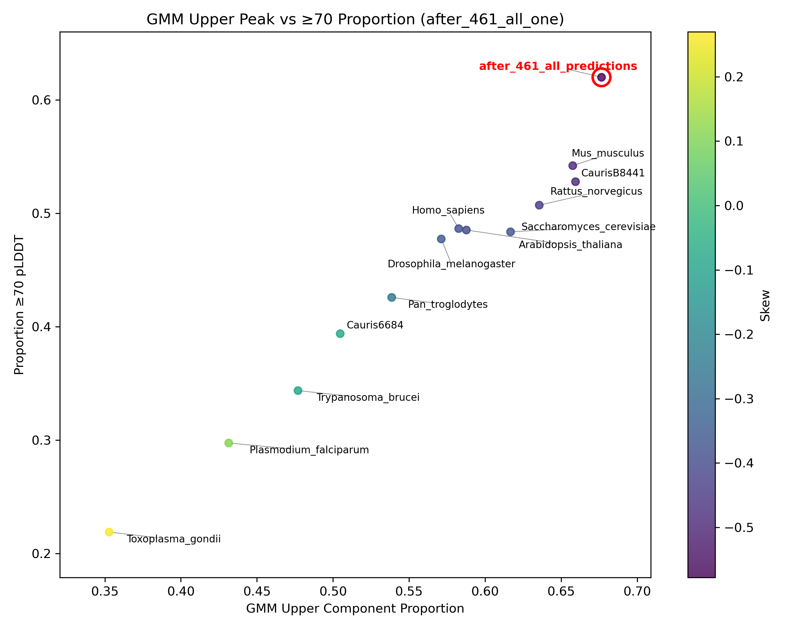
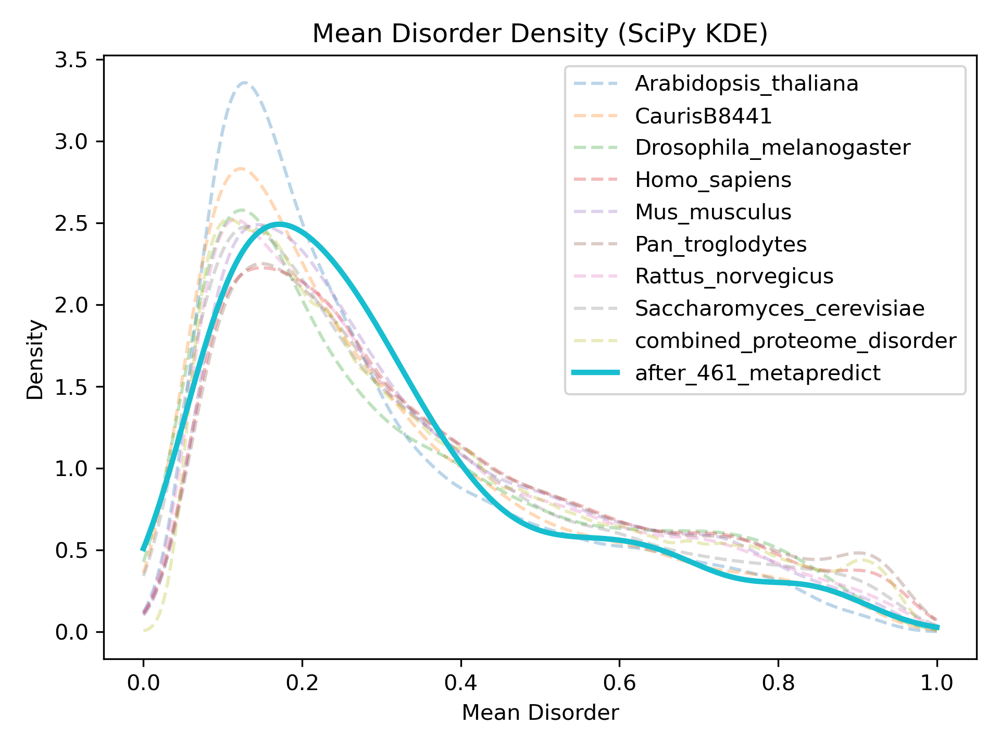
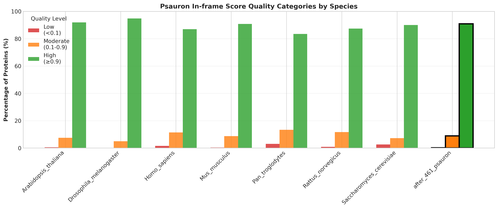
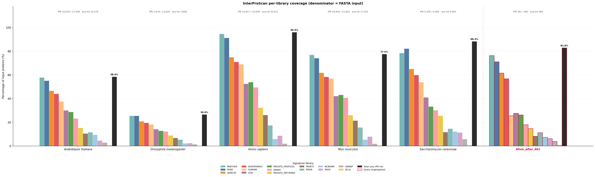
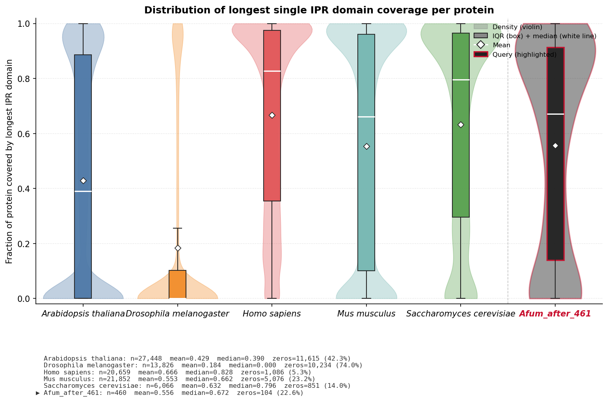

# genome_annotation_quality_nextflow_pipeline

Nextflow pipeline for large-scale protein structure prediction,
intrinsic disorder analysis, and genome annotation quality assessment
using **Protenix**, **Metapredict**, **PSAURON**, and **Interproscan**.

------------------------------------------------------------------------

## Overview

This repository contains a **Nextflow DSL2 pipeline** for:

- Large-scale protein structure prediction using Protenix
- Intrinsic disorder prediction using Metapredict
- Protein-coding sequence quality assessment using PSAURON
- Functional domain annotation and coverage profiling using InterProScan
- Automated chunking and HPC parallelisation
- Model processing and metric extraction
- Comparative plotting against reference proteome datasets

The pipeline is designed for HPC environments (SLURM supported)
and supports GPU acceleration where appropriate.

------------------------------------------------------------------------
## Protenix-Mini Overview

Accurate protein structure prediction is often computationally intensive, limiting scalability for large-scale or real-world applications. Protenix-Mini is a lightweight, optimized variant of the Protenix framework designed to balance computational efficiency with high predictive accuracy. It achieves this through several key architectural refinements: replacing the multi-step AF3 diffusion sampler with a reduced-step Ordinary Differential Equation (ODE) sampler to lower inference overhead, pruning non-contributory Transformer components within the pairformer and diffusion modules, and incorporating an ESM-based protein language model to substitute the traditional MSA module—thereby eliminating costly MSA preprocessing. These modifications substantially reduce model complexity and runtime while maintaining high structural fidelity. Benchmark evaluations demonstrate only a minimal 1–5% decrease in performance relative to the full-scale model. Protenix-Mini therefore enables efficient, GPU-accelerated structure prediction suitable for large proteomes and resource-constrained environments, making it well suited for high-throughput genome annotation quality assessment workflows.
## Metapredict Overview

Intrinsically disordered proteins and intrinsically disordered regions (IDRs) play essential roles in cellular regulation, signaling, phase separation, and molecular recognition. Accurate identification of IDRs directly from sequence is therefore critical for understanding protein function at scale. Metapredict is a state-of-the-art disorder prediction tool designed for both high accuracy and extremely high throughput, enabling proteome-scale analyses in seconds. Developed with usability in mind, Metapredict is distributed as a web server, Python package, command-line interface, and Google Colab notebook. Leveraging deep learning–based predictions trained across diverse datasets, Metapredict V3 enables evolutionary-scale disorder analysis across thousands of proteomes. In this pipeline, Metapredict is integrated as a GPU-accelerated step to generate per-protein disorder metrics and comparative distributions against large multi-species reference datasets, facilitating genome-wide disorder profiling and annotation quality assessment.
## PSAURON Overview

Evaluating the accuracy of protein-coding sequences in genome annotations
is a challenging problem with no broadly applicable universal solution.

PSAURON (Protein Sequence Assessment Using a Reference ORF Network)
is a machine learning–based tool trained on a diverse dataset of over
1000 plant and animal genomes. It assigns a score to coding DNA or protein
sequences reflecting the likelihood that the sequence represents a genuine
protein-coding region.

PSAURON scores enable:

- Genome-wide protein annotation quality assessment
- Rapid identification of potentially spurious protein annotations
- Comparative overlay against large multi-species reference datasets

This pipeline integrates PSAURON scoring directly into structure and
disorder prediction workflows for multi-metric genome annotation QC.

## InterProScan Overview

Functional annotation of protein sequences is a cornerstone of genome
quality assessment. InterProScan integrates fifteen member databases —
including PFAM, PANTHER, GENE3D, SUPERFAMILY, FUNFAM, CDD, SMART, PRINTS,
HAMAP, PIRSF, PIRSR, SFLD, NCBIFAM, PROSITE_PROFILES and PROSITE_PATTERNS —
to assign protein family, domain, and functional site signatures, mapping
them where possible to the unified InterPro classification.

In this pipeline, InterProScan is used to compute two complementary
genome-quality metrics:

- **Per-library coverage**: the percentage of input proteins matched by
  each signature library, plus an overall "any IPR hit" total. This
  reveals which evidence sources are dominant for a given proteome and
  flags annotation gaps relative to reference organisms.
- **Per-protein domain coverage**: for every protein, the fraction of
  residues covered by the union of its IPR-bearing matches (overlapping
  hits merged so residues are not double-counted), giving a length-
  normalised score between 0 and 1. The distribution of this score
  across the proteome is a sensitive indicator of annotation quality —
  proteomes with many short, fragmented, or spurious annotations
  typically show a heavy excess of low-coverage proteins relative to
  well-annotated reference organisms.

The InterProScan branch is **optional** and is enabled with
`--run_interpro true`. Because InterProScan is computationally expensive,
the pipeline parallelises it by chunking the input FASTA, running each
chunk independently, and concatenating the per-chunk XML/TSV outputs
before plotting.


## Installation Instructions

Follow these steps to install and set up the **Nextflow Genome Annotation Quality Pipeline**:

### 1. Install Nextflow

Nextflow is required to run the pipeline.

```bash

curl -s https://get.nextflow.io | bash

mv nextflow ~/bin/

nextflow -version
```

> Ensure `~/bin` is in your `PATH` or adjust the path accordingly.

---

### 2. Install Java (if needed)

Nextflow requires Java 8+:

```bash

sudo apt-get install openjdk-11-jdk


java -version
```

---

### 3. Download the Pipeline Repository

```bash
git clone https://github.com/mesdaghi/genome_annotation_quality_nextflow_pipeline
cd genome_annotation_quality_nextflow_pipeline
```

---

### 4. Setup Singularity/ Apptainer Images

Currently, the pipeline builds the containers using a nox session. To do this, first install pipx and then use it to install nox:

```bash
python3 -m pip install --user pipx
python3 -m pipx ensurepath
```

Then install nox:

```bash
pipx install nox
```


Finally, build the singularity/apptainer images:

```bash
nox -s build_apptainer -- --output /path/to/singularity_images
```
### 5. Download InterProScan Data

The exact steps for downloading InterProScan data can be found here [InterProScan Data Download](https://interproscan-docs.readthedocs.io/en/v5/HowToUseViaContainer.html). But, in short, you can download the data using the following commands


```bash
curl -O http://ftp.ebi.ac.uk/pub/software/unix/iprscan/5/5.78-109.0/alt/interproscan-data-5.78-109.0.tar.gz

tar -pxzf interproscan-data-5.78-109.0.tar.gz
```

### 6. Run a Test Pipeline

Please specifiy the path to your singularity images directory in the singularity.config file before running the pipeline. (or as a parameter `--singularity_image_dir /path/to/singularity_images`)

There are two profiles available for testing:
1. 'singularity_local' — runs the pipeline locally using Singularity containers
2. 'singularity_slurm' — runs the pipeline on an HPC cluster with SLURM, using Singularity containers

```bash
nextflow run main.nf -profile slurm_local --fasta example.fasta --chunk_size 100 --singularity_image_dir /path/to/singularity_images

```
If using InterProScan, please specify the path to your InterProScan data directory in the singularity.config file before running the pipeline. (or as a parameter `--interpro_data /path/to/interpro_data`) For example:

```bash
nextflow run main.nf -profile slurm_local --fasta example.fasta --chunk_size 100 --singularity_image_dir /path/to/singularity_images --use_interpro true --interpro_data /path/to/interpro_data/interproscan-5.77-108.0/data/
```

- `--fasta` : Path to input FASTA file  
- `--chunk_size` : Number of sequences per Protenix chunk  
- `--singularity_image_dir` : Path to directory containing  
Singularity images (optional if set in config)
`--protenix_cahce `: Path to Protenix cache directory (optional, can also be set via nextflow.config)
`--run_interpro` : Enable InterPro branch. `true` = run InterProScan; `/path/to/x.xml` = plot only (optional, default: false)
`--interpro_data` : Path to InterProScan data directory (optional, can also be set via nextflow.config)

All output (plots, PKL files, CSVs) will be stored under `results/`.


---

### Notes

- Make sure your environments are accessible on the compute nodes.  
- Set `PROTENIX_CACHE` before running Protenix predictions.  


## Features

### Structure Prediction (Protenix)

- FASTA → Protenix JSON conversion
- JSON chunk splitting for parallel inference
- GPU-accelerated Protenix prediction
- Automatic model collection and aggregation
- pLDDT extraction into PKL datasets
- Distribution plotting vs reference organisms

### Disorder Prediction (Metapredict)

- GPU-accelerated disorder prediction
- Automatic overlay vs reference proteome disorder database
- Histogram and KDE density plots

### Protein-Coding Quality Assessment (PSAURON)

- GPU-accelerated PSAURON scoring
- Overlay of new dataset vs precomputed multi-species reference
- Histogram and KDE density plots
- Automated integration into Nextflow workflow

### Functional Domain Annotation (InterProScan)

- Optional, FASTA-driven InterProScan branch (`--run_interpro true`)
- Automatic chunking and parallel execution across HPC compute nodes
- Concatenation of per-chunk XML/TSV outputs into a single result
- Per-library coverage bar chart with the query highlighted alongside
  five reference model organisms
- Per-protein merged-domain coverage violin/box plot showing the
  distribution of residue-level IPR coverage across the proteome
- Tab-separated summary table of per-species coverage metrics
- Acceptance of a precomputed XML via `--run_interpro /path/to/xml`,
  skipping the (expensive) InterProScan step

------------------------------------------------------------------------

## Workflow Diagram

                              FASTA
                /        |          |          \
               /         |          |           \
          PROTENIX  METAPREDICT  PSAURON  INTERPROSCAN (optional)
              |          |          |           |
           pLDDT PKL    CSV        CSV       XML / TSV
              |          |          |           |
          PLOT_PLDDT  PLOT_META  PLOT_PSAURON  PLOT_INTERPRO
              |          |          |           |
             PNG        PNG        PNG     PNG ×2 + TSV
                \        |          |           /
                 \       |          |          /
                            FINAL REPORT
------------------------------------------------------------------------

## Requirements

### Core Software

- Nextflow ≥ 23
- Python 3.10
- CUDA-enabled GPU (recommended for Protenix, Metapredict, PSAURON)
- SLURM (optional, HPC environments)

------------------------------------------------------------------------

## Running the Pipeline

### Basic Run

```bash
nextflow run main.nf -profile slurm --fasta after_461.fasta --chunk_size 100
```

### Parameters

| Parameter              | Description                                                                       |
|------------------------|-----------------------------------------------------------------------------------|
| --chunk_size           | Number of sequences per Protenix chunk                                            |
| --fasta                | Path to input FASTA file                                                          |
| --run_interpro         | Enable InterPro branch. `true` = run InterProScan; `/path/to/x.xml` = plot only   |
| --ipr_reference_json   | Path to reference model-organism JSON (default: `bin/ipr_coverage.json`)          |

### Running with the InterProScan branch

The InterProScan branch is opt-in. By default it is disabled.

```bash
# Full branch — runs InterProScan from scratch on the input FASTA
nextflow run main.nf -profile slurm \
    --fasta after_461.fasta \
    --run_interpro true

# Plot-only — skip the (expensive) InterProScan step and reuse a
# previously generated XML, paired with the dataset's FASTA
nextflow run main.nf -profile slurm \
    --fasta after_461.fasta \
    --run_interpro /path/to/precomputed_interproscan_output.xml

# Override the reference model-organism dataset
nextflow run main.nf -profile slurm \
    --fasta after_461.fasta \
    --run_interpro true \
    --ipr_reference_json /path/to/custom_ipr_coverage.json
```

------------------------------------------------------------------------

## Output Structure

    results/
     ├── plots/
     │    ├── plddt_hist_<dataset>.png
     │    ├── plddt_density_statsmodels_<dataset>.png
     │    └── plddt_density_scipy_<dataset>.png
     │
     ├── metapredict_plots/
     │    ├── <dataset>_mean_disorder_hist.png
     │    ├── <dataset>_mean_disorder_density_statsmodels.png
     │    └── <dataset>_mean_disorder_density_scipy.png
     │
     ├── psauron_plots/
     │    ├── psauron_hist.png
     │    ├── psauron_density_statsmodels.png
     │    └── psauron_density_scipy.png
     │
     └── interpro_plots/                       (only if --run_interpro)
          ├── interpro_domain_coverage.png
          ├── interpro_merged_coverage_distribution.png
          └── interpro_summary.tsv

Intermediate outputs:

- protenix_out/
- *_all_predictions/
- plddt_all_values_<dataset>_all_one.pkl
- <dataset>_metapredict.csv
- <dataset>_psauron.csv
- <dataset>_interproscan.xml / <dataset>_interproscan.tsv     (interpro branch)

------------------------------------------------------------------------
## Example Output Images

### pLDDT Distribution Example



## Proteome Structural Confidence Landscape

This plot positions each species according to two complementary measures of proteome structural quality derived from AlphaFold pLDDT scores, allowing the query proteome to be interpreted in the context of well-characterised reference organisms.



### Axes

**X-axis — GMM Upper Component Proportion**
Each species' pLDDT distribution is modelled as a two-component Gaussian Mixture Model (GMM), capturing the characteristic bimodal shape seen in most proteomes — a lower-confidence disordered peak and a higher-confidence structured peak. The x-axis shows the weight of the upper (higher pLDDT) component, i.e. the proportion of proteins belonging to the high-confidence structured peak. Species further right have a greater fraction of their proteome in the structured, high-confidence GMM component.

**Y-axis — Proportion ≥70 pLDDT**
A simpler, threshold-based measure of the same concept — the fraction of proteins with a mean pLDDT ≥ 70, a commonly used cutoff distinguishing confidently modelled from poorly modelled regions. The two axes are expected to correlate, but divergence between them can indicate unusual distributional shapes.

### Colour — Skew
Points are coloured by the skewness of each species' pLDDT distribution. Negative skew (purple) indicates a distribution pulled toward lower pLDDT values, typical of proteomes with a large disordered or low-complexity fraction. Positive skew (yellow) indicates a tail toward higher confidence values.

### Red circle — Query species
The input dataset is highlighted with a red circle and bold label, allowing its structural quality profile to be interpreted relative to reference proteomes. Its position gives an intuitive indication of whether the proteome resembles organisms with high structural coverage (top right, e.g. vertebrates) or those with more disordered or low-confidence proteomes (bottom left, e.g. parasitic protozoa).

### GMM initialisation
To ensure consistent and comparable fits across species, the GMM for each species is initialised using parameters averaged from six reference species — *Drosophila melanogaster*, *Homo sapiens*, *Rattus norvegicus*, *Mus musculus*, *Pan troglodytes*, and *Arabidopsis thaliana* — rather than random starting points.

### Metapredict Disorder Example



### PSAURON Example



### InterPro Per-Library Coverage Example

This plot shows the percentage of input proteins matched by each
InterProScan signature library, with the query species highlighted on the
right. The final dark "Total (any IPR hit)" bar gives the headline
overall coverage figure (e.g. 58.4% for *Arabidopsis thaliana*).



#### How to interpret
- **Per-library bars** show what fraction of the proteome is matched by
  each library individually. A protein hit by both PFAM and PANTHER will
  contribute to both bars — these are not stacked, so summing across
  libraries does not give the total.
- **Total bar** shows the percentage of proteins with at least one hit
  from any IPR-bearing library — the canonical "InterPro coverage" figure.
- **Library order** is determined by aggregate hit count across all
  species in the reference set, so the most informative libraries
  appear leftmost.

### InterPro Per-Protein Coverage Distribution Example

This plot shows the distribution of length-normalised IPR coverage
across every protein in each proteome. For each protein, all IPR-bearing
hits are merged (overlapping intervals counted once) and the covered
residues divided by the protein length to give a score between 0 and 1.



#### How to interpret
- **Violin shape** shows the density of coverage values at each level.
  Most well-annotated proteomes are bimodal: a peak at 0 (proteins with
  no IPR hit) and a peak near 1 (single-domain proteins fully covered
  by their domain).
- **Box overlay** shows the IQR and median (white line); the white
  diamond marks the mean.
- **Stats line** below the plot reports n, mean, median, and the count
  of zero-coverage proteins per species — the latter is often the most
  diagnostic single number for annotation quality.
- **Query species** appears at the right with a red border and is
  separated from the reference set by a dashed grey line.

------------------------------------------------------------------------
## Reference Datasets
### Protein Model Reference  
    bin/plddt_model_organisms.csv
### Disorder Reference

    bin/combined_proteome_disorder.pkl

### PSAURON Reference

    bin/combined_psauron_results.csv

Precomputed multi-species PSAURON score distribution used as background
for comparative overlay plots.

### InterPro Reference

    bin/ipr_coverage.json

Precomputed InterProScan coverage data for five reference model
organisms — *Arabidopsis thaliana*, *Drosophila melanogaster*,
*Homo sapiens*, *Mus musculus*, and *Saccharomyces cerevisiae* —
including per-library hit counts, overall coverage percentages, and
per-protein merged-domain coverage vectors. Used by `bin/plot_interpro.py`
to overlay the query proteome against well-characterised references.

To regenerate or extend this dataset, run the standalone reporter script
described in `bin/ipr_coverage.README.md`.

------------------------------------------------------------------------

## Pipeline Processes

| Process               | Description                                 |
|-----------------------|---------------------------------------------|
| FASTA_TO_JSON         | Converts FASTA → Protenix JSON              |
| SPLIT_JSON            | Splits JSON into chunk files                |
| PROTENIX_PREDICT      | Runs Protenix inference (GPU)               |
| COLLECT_CHUNKS        | Merges chunk prediction outputs             |
| PROCESS_MODELS        | Extracts pLDDT values into PKL              |
| PLOT_PLDDT            | Generates structure confidence plots        |
| METAPREDICT_DISORDER  | Runs disorder prediction (GPU)              |
| PLOT_METAPREDICT      | Generates disorder comparison plots         |
| PSAURON_RUN           | Runs PSAURON scoring (GPU)                  |
| PLOT_PSAURON          | Generates PSAURON overlay distribution plots|
| CHUNK_IPR             | Splits FASTA into InterProScan chunks       |
| INTERPROSCAN          | Runs InterProScan on each chunk             |
| CONCAT_IPR            | Merges per-chunk XML/TSV results            |
| PLOT_INTERPRO         | Generates InterPro coverage comparison plots|

------------------------------------------------------------------------

## Author

Shahram Mesdaghi

## Contributing

Luc Elliott
