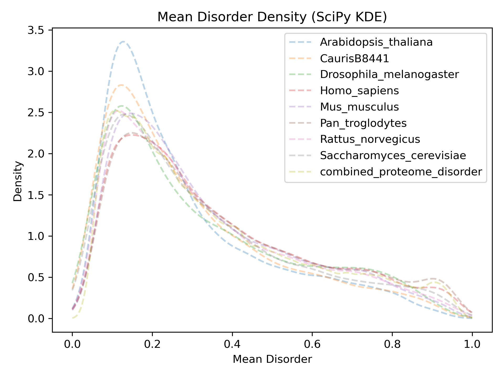
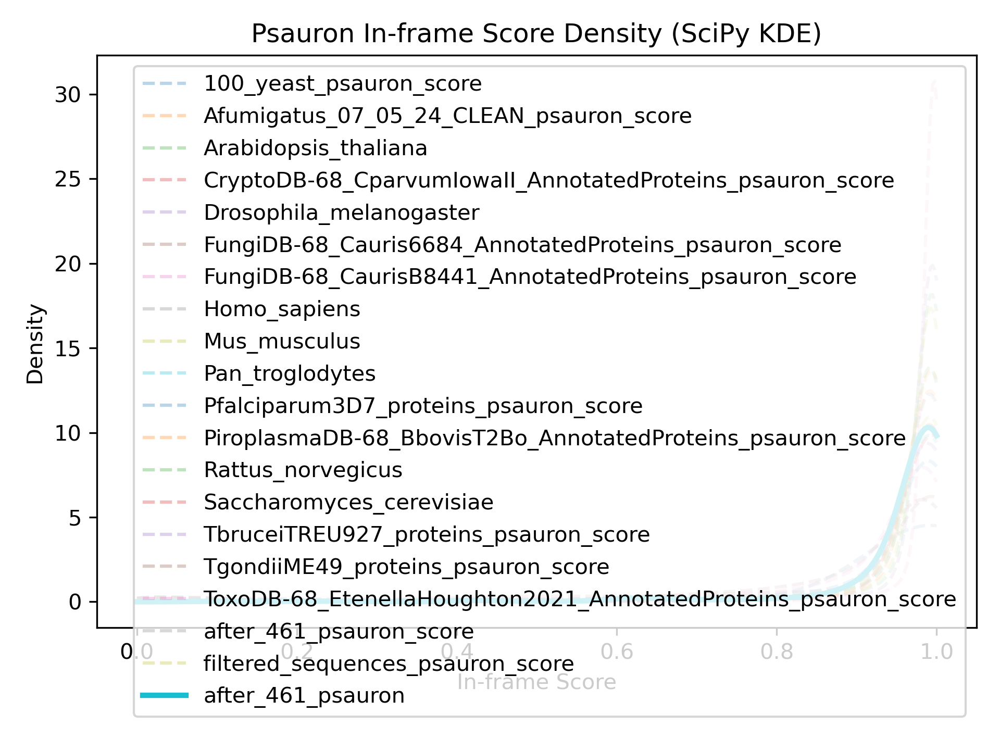

# genome_annotation_quality_nextflow_pipeline

Nextflow pipeline for large-scale protein structure prediction,
intrinsic disorder analysis, and genome annotation quality assessment
using **Protenix**, **Metapredict**, and **PSAURON**.

------------------------------------------------------------------------

## Overview

This repository contains a **Nextflow DSL2 pipeline** for:

- Large-scale protein structure prediction using Protenix
- Intrinsic disorder prediction using Metapredict
- Protein-coding sequence quality assessment using PSAURON
- Automated chunking and HPC parallelisation
- Model processing and metric extraction
- Comparative plotting against reference proteome datasets

The pipeline is designed for HPC environments (SLURM supported)
and supports GPU acceleration where appropriate.

------------------------------------------------------------------------
## Protenix-Mini Overview

Accurate protein structure prediction is often computationally intensive, limiting scalability for large-scale or real-world applications. Protenix-Mini is a lightweight, optimized variant of the Protenix framework designed to balance computational efficiency with high predictive accuracy. It achieves this through several key architectural refinements: replacing the multi-step AF3 diffusion sampler with a reduced-step Ordinary Differential Equation (ODE) sampler to lower inference overhead, pruning non-contributory Transformer components within the pairformer and diffusion modules, and incorporating an ESM-based protein language model to substitute the traditional MSA module—thereby eliminating costly MSA preprocessing. These modifications substantially reduce model complexity and runtime while maintaining high structural fidelity. Benchmark evaluations demonstrate only a minimal 1–5% decrease in performance relative to the full-scale model. Protenix-Mini therefore enables efficient, GPU-accelerated structure prediction suitable for large proteomes and resource-constrained environments, making it well suited for high-throughput genome annotation quality assessment workflows.
## Metapredict Overview

Intrinsically disordered proteins and intrinsically disordered regions (IDRs) play essential roles in cellular regulation, signaling, phase separation, and molecular recognition. Accurate identification of IDRs directly from sequence is therefore critical for understanding protein function at scale. Metapredict is a state-of-the-art disorder prediction tool designed for both high accuracy and extremely high throughput, enabling proteome-scale analyses in seconds. Developed with usability in mind, Metapredict is distributed as a web server, Python package, command-line interface, and Google Colab notebook. Leveraging deep learning–based predictions trained across diverse datasets, Metapredict V3 enables evolutionary-scale disorder analysis across thousands of proteomes. In this pipeline, Metapredict is integrated as a GPU-accelerated step to generate per-protein disorder metrics and comparative distributions against large multi-species reference datasets, facilitating genome-wide disorder profiling and annotation quality assessment.
## PSAURON Overview

Evaluating the accuracy of protein-coding sequences in genome annotations
is a challenging problem with no broadly applicable universal solution.

PSAURON (Protein Sequence Assessment Using a Reference ORF Network)
is a machine learning–based tool trained on a diverse dataset of over
1000 plant and animal genomes. It assigns a score to coding DNA or protein
sequences reflecting the likelihood that the sequence represents a genuine
protein-coding region.

PSAURON scores enable:

- Genome-wide protein annotation quality assessment
- Rapid identification of potentially spurious protein annotations
- Comparative overlay against large multi-species reference datasets

This pipeline integrates PSAURON scoring directly into structure and
disorder prediction workflows for multi-metric genome annotation QC.

------------------------------------------------------------------------

## Features

### Structure Prediction (Protenix)

- FASTA → Protenix JSON conversion
- JSON chunk splitting for parallel inference
- GPU-accelerated Protenix prediction
- Automatic model collection and aggregation
- pLDDT extraction into PKL datasets
- Distribution plotting vs reference organisms

### Disorder Prediction (Metapredict)

- GPU-accelerated disorder prediction
- Automatic overlay vs reference proteome disorder database
- Histogram and KDE density plots

### Protein-Coding Quality Assessment (PSAURON)

- GPU-accelerated PSAURON scoring
- Overlay of new dataset vs precomputed multi-species reference
- Histogram and KDE density plots
- Automated integration into Nextflow workflow

------------------------------------------------------------------------

## Workflow Diagram

                          FASTA
                   /       |        \
                  /        |         \
             PROTENIX  METAPREDICT      PSAURON
                |           |              |
             pLDDT PKL     CSV            CSV
                |           |              |
            PLOT_PLDDT  PLOT_METAPREDICT  PLOT_PSAURON
                |           |              |
               PNG         PNG            PNG

------------------------------------------------------------------------

## Requirements

### Core Software

- Nextflow ≥ 23
- Python 3.10
- CUDA-enabled GPU (recommended for Protenix, Metapredict, PSAURON)
- SLURM (optional, HPC environments)

------------------------------------------------------------------------

## Running the Pipeline

### Basic Run

```bash
nextflow run main.nf -profile slurm --fasta after_461.fasta --chunk_size 100
```

### Parameters

| Parameter     | Description                                |
|--------------|--------------------------------------------|
| --chunk_size | Number of sequences per Protenix chunk     |
| --fasta      | Path to input FASTA file                   |

------------------------------------------------------------------------

## Output Structure

    results/
     ├── plots/
     │    ├── plddt_hist_<dataset>.png
     │    ├── plddt_density_statsmodels_<dataset>.png
     │    └── plddt_density_scipy_<dataset>.png
     │
     ├── metapredict_plots/
     │    ├── <dataset>_mean_disorder_hist.png
     │    ├── <dataset>_mean_disorder_density_statsmodels.png
     │    └── <dataset>_mean_disorder_density_scipy.png
     │
     └── psauron_plots/
          ├── psauron_hist.png
          ├── psauron_density_statsmodels.png
          └── psauron_density_scipy.png

Intermediate outputs:

- protenix_out/
- *_all_predictions/
- plddt_all_values_<dataset>_all_one.pkl
- <dataset>_metapredict.csv
- <dataset>_psauron.csv

------------------------------------------------------------------------
## Example Output Images

### pLDDT Distribution Example

Place example images inside:

    docs/images/

Then reference them in README like:


### Metapredict Disorder Example



### PSAURON Example



------------------------------------------------------------------------
## Reference Datasets
### Protein Model Reference  
    bin/plddt_model_organisms.csv
### Disorder Reference

    bin/combined_proteome_disorder.pkl

### PSAURON Reference

    bin/combined_psauron_results.csv

Precomputed multi-species PSAURON score distribution used as background
for comparative overlay plots.

------------------------------------------------------------------------

## Pipeline Processes

| Process               | Description                                 |
|-----------------------|---------------------------------------------|
| FASTA_TO_JSON         | Converts FASTA → Protenix JSON              |
| SPLIT_JSON            | Splits JSON into chunk files                |
| PROTENIX_PREDICT      | Runs Protenix inference (GPU)               |
| COLLECT_CHUNKS        | Merges chunk prediction outputs             |
| PROCESS_MODELS        | Extracts pLDDT values into PKL              |
| PLOT_PLDDT            | Generates structure confidence plots        |
| METAPREDICT_DISORDER  | Runs disorder prediction (GPU)              |
| PLOT_METAPREDICT      | Generates disorder comparison plots         |
| PSAURON_RUN           | Runs PSAURON scoring (GPU)                  |
| PLOT_PSAURON          | Generates PSAURON overlay distribution plots|

------------------------------------------------------------------------

## Author

Shahram Mesdaghi
